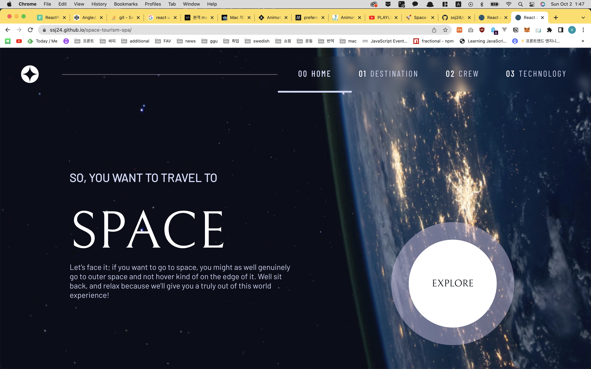
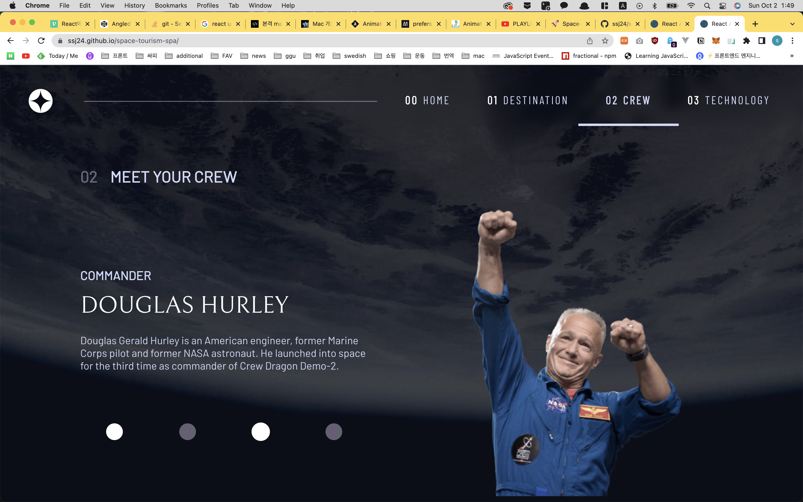
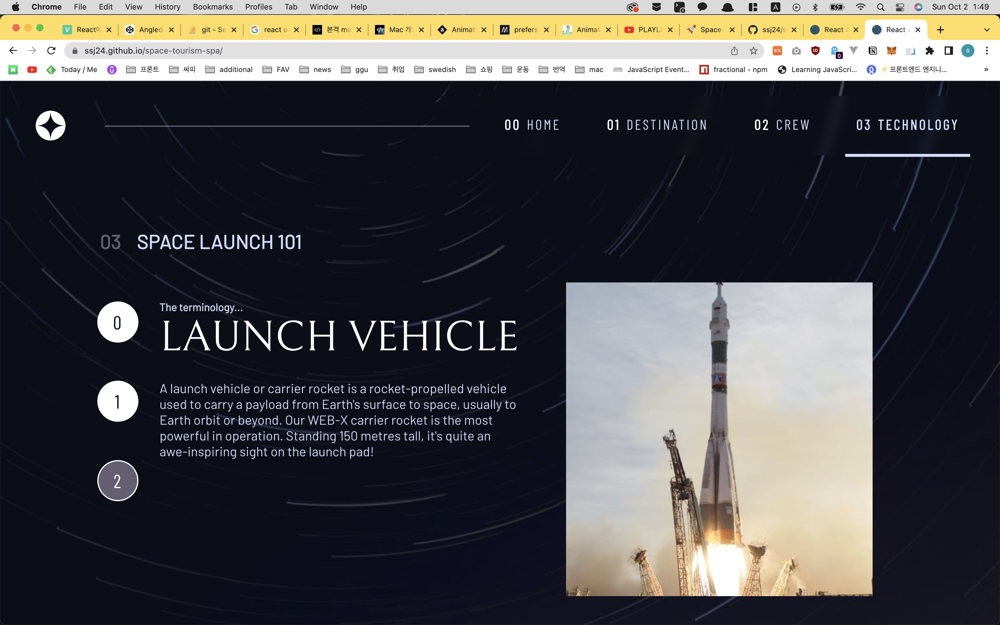

# Frontend Mentor - Space tourism website solution

This is a solution to the [Space tourism website challenge on Frontend Mentor](https://www.frontendmentor.io/challenges/space-tourism-multipage-website-gRWj1URZ3). Frontend Mentor challenges help you improve your coding skills by building realistic projects. 


## Overview

### The challenge

Users should be able to:

- View the optimal layout for each of the website's pages depending on their device's screen size
- See hover states for all interactive elements on the page
- View each page and be able to toggle between the tabs to see new information

### Screenshot



explore button's active state

when you click the button, you will see the destination page


destination page

nav hover and active state



crew page

nav dot's hover and active state



technology page

nav hover and active state


### Links

- [Github](https://github.com/ssj24/space-tourism-spa)

- [Live Site](https://ssj24.github.io/space-tourism-spa/) - github pages

  

## My process

### Built with

- Semantic HTML5 markup
- CSS custom properties
- Flexbox
- [React](https://reactjs.org/) - JS library
- [animate.css](https://animate.style/) - For styles


### What I learned

- image path with react

  I wanted to use an image path from local json file.

  `"png": "/images/destination/image-moon.png"`

  since it is not importing, I couldn't get the image.

  solution is using PUBLIC_URL.

  ```javascript
  
  ```

- animation

  applying animation on the images

  `AOS` is the one I tried at first.

  I have different image with every tab changing,

  and AOS are not applying animation on tab changing.

  So, I found `animate.css`.

  This one also doesn't work like I wanted.

  But I could change with javascript.

  